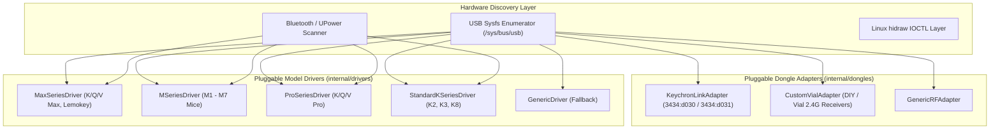
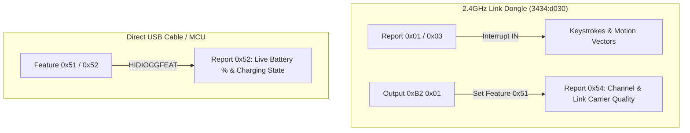

# keychron-battery

[](https://golang.org/)
[](LICENSE)
[](https://kernel.org)

High-performance native Linux battery & peripheral monitor for **Keychron** wireless mice and keyboards over **2.4GHz USB Link Dongles**, **USB-C Cable**, and **Bluetooth**.

Written in pure Go with direct Linux kernel `hidraw` IOCTL support—zero runtime dependencies, zero Python overhead, executing in sub-milliseconds.

---

```text
󰌌  Keychron K3 Max     100% 󰁹  ██████████     󱎫  5h 30m      󰤨  100%      󰖩  2.4G
󰍽  Keychron M6          98% 󰁹  █████████░     󱎫  2h 15m      󰤨  100%      󰖩  2.4G
```

---

## Features

* **⚡ Native Linux IOCTL**: Directly decodes Keychron vendor Feature Reports (`0x51` / `0x52`) via kernel `HIDIOCGFEAT` to extract real-time battery percentages and charging states.
* **⏱️ Battery Duration / Uptime Tracking**: Tracks elapsed operational runtime since the last full charge (`󱎫  2h 15m`, `1d 4h`, `⚡ Charging`).
* **📡 2.4GHz Link RF Carrier Telemetry**: Interrogates Keychron 2.4GHz Link receivers (`3434:d030`) via Report `0x54` queries for RF channel status and connection link quality.
* **💾 Battery State Persistence**: Automatically caches the last verified battery state (`~/.cache/keychron/battery_cache.json`) when transitioning between USB cable, Bluetooth, and 2.4GHz wireless modes.
* **🎨 Clean Nerd Font CLI**: Clean, borderless table view with 2-cell Nerd Font width alignment and color-coded status badges.
* **🔔 Native Desktop Alerts**: Built-in `--notify` flag sending desktop notifications via `notify-send` on low-battery events.
* **🔄 Daemon Mode**: Run as a lightweight background service (`keychron-battery --daemon`) with systemd user unit support.
* **📊 JSON Output**: Fully structured `--json` output for Waybar, Polybar, Rofi, or custom status bar modules.

---

## Supported Peripherals

* **Keychron M-Series Mice**: M6, M3, M1, M7, M3 Mini (USB-C / 2.4GHz Link `3434:d030` / Bluetooth).
* **Keychron Max Keyboards**: K3 Max, K1 Max, K5 Max, Q Max series, V Max series, Lemokey series (USB-C / 2.4GHz Link / Bluetooth).

---

## Installation

### Prerequisites
* Linux kernel 5.x+
* Go 1.22+ (for compiling from source)
* [Nerd Fonts](https://www.nerdfonts.com/) (for terminal glyphs)

### From Source

```bash
git clone https://github.com/dolfbarr/keychron-battery.git
cd keychron-battery
make
sudo make install
```

### Via Go Install

```bash
go install github.com/dolfbarr/keychron-battery/cmd/keychron-battery@latest
```

### NixOS

Enter the development shell and install the binary and user service into your
home directory. This target does not modify `/etc`, NixOS configuration files,
or udev rules:

```bash
nix-shell
make install-nix
```

The target places the binary in `~/.local/bin` and enables
`keychron-battery.service` as a systemd user service. Add the following to
`/etc/nixos/configuration.nix` for non-root HID access, then run
`sudo nixos-rebuild switch`:

```nix
services.udev.extraRules = ''
  KERNEL=="hidraw*", ATTRS{idVendor}=="3434", MODE="0666", TAG+="uaccess"
'';
```

### Udev Rules (Non-Root Access)

To allow `keychron-battery` to communicate with `/dev/hidraw*` endpoints without root permissions:

```bash
sudo cp 50-keychron.rules /etc/udev/rules.d/
sudo udevadm control --reload-rules && sudo udevadm trigger
```

---

## CLI Usage

### Default View (Borderless & Clean)
```bash
keychron-battery
```
```text
󰌌  Keychron K3 Max     100% 󰁹  ██████████     󰤨  100%      󰖩  2.4G
󰍽  Keychron M6          98% 󰁹  █████████░     󰤨  100%      󰖩  2.4G
```

### Table View
```bash
keychron-battery --table
```
```text
╭────────────────────┬──────────┬─────────┬─────────╮
│ DEVICE             │ BATTERY  │ SIGNAL  │ MODE    │
├────────────────────┼──────────┼─────────┼─────────┤
│ 󰌌  Keychron K3 Max │ 100% 󰁹  │ 󰤨  100% │ 󰖩  2.4G │
│ 󰍽  Keychron M6     │  98% 󰁹  │ 󰤨  100% │ 󰖩  2.4G │
╰────────────────────┴──────────┴─────────┴─────────╯
```

### JSON Mode (Waybar / Polybar Integration)
```bash
keychron-battery --json
```
```json
[
  {
    "name": "Keychron K3 Max",
    "icon": "󰌌 ",
    "type": "󰖩  2.4G",
    "battery": 100,
    "charging": false,
    "estimated": false,
    "signal": "󰤨  100%"
  },
  {
    "name": "Keychron M6",
    "icon": "󰍽 ",
    "type": "󰖩  2.4G",
    "battery": 98,
    "charging": false,
    "estimated": false,
    "signal": "󰤨  100%"
  }
]
```

### Desktop Notification
```bash
keychron-battery --notify
```

### Continuous Watch Mode
```bash
keychron-battery --watch 2
```

---

## Architecture & Extension Guide



### Adding Support for New Dongles or Custom Hardware
Adding support for a new 2.4GHz receiver (e.g. for Pro or K series keyboards flashed with wireless dongles) requires implementing only the `DongleAdapter` interface:

```go
type MyCustomDongleAdapter struct{}

func (a *MyCustomDongleAdapter) ID() string { return "my_dongle" }
func (a *MyCustomDongleAdapter) Matches(product, pid string) bool { ... }
func (a *MyCustomDongleAdapter) ProbeCarrier(nodes []string) (string, bool) { ... }
```
And registering it via `dongles.Register(&MyCustomDongleAdapter{})`.

---

## Reverse-Engineered HID Protocol



### Packet Specifications:
* **Feature Report `0x51` / `0x52` (Power Telemetry)**:
  `[ 0x52, <BATTERY_%>, <FW_REV>, 0x00, <CHARGING_FLAG>, 0x00, ... ]`
  * `Byte 1`: Current battery level ($1$–$100$).
  * `Byte 4`: Charging bit ($1 = \text{Charging ⚡}$, $0 = \text{Discharging}$).
* **Link Carrier Status Report `0x54`**:
  `[ 0x54, <CHANNEL_ID>, <LINK_FLAG>, 0x00, ... ]`
  * `Byte 1`: Active RF channel.
  * `Byte 2`: 2.4GHz carrier link status.

---

## Background Daemon & Systemd

To run `keychron-battery` as a background monitoring daemon:

```bash
mkdir -p ~/.config/systemd/user
cp keychron-battery.service ~/.config/systemd/user/
systemctl --user daemon-reload
systemctl --user enable --now keychron-battery.service
```

---

## License

MIT License. Copyright (c) 2026 Dolf Barr.
